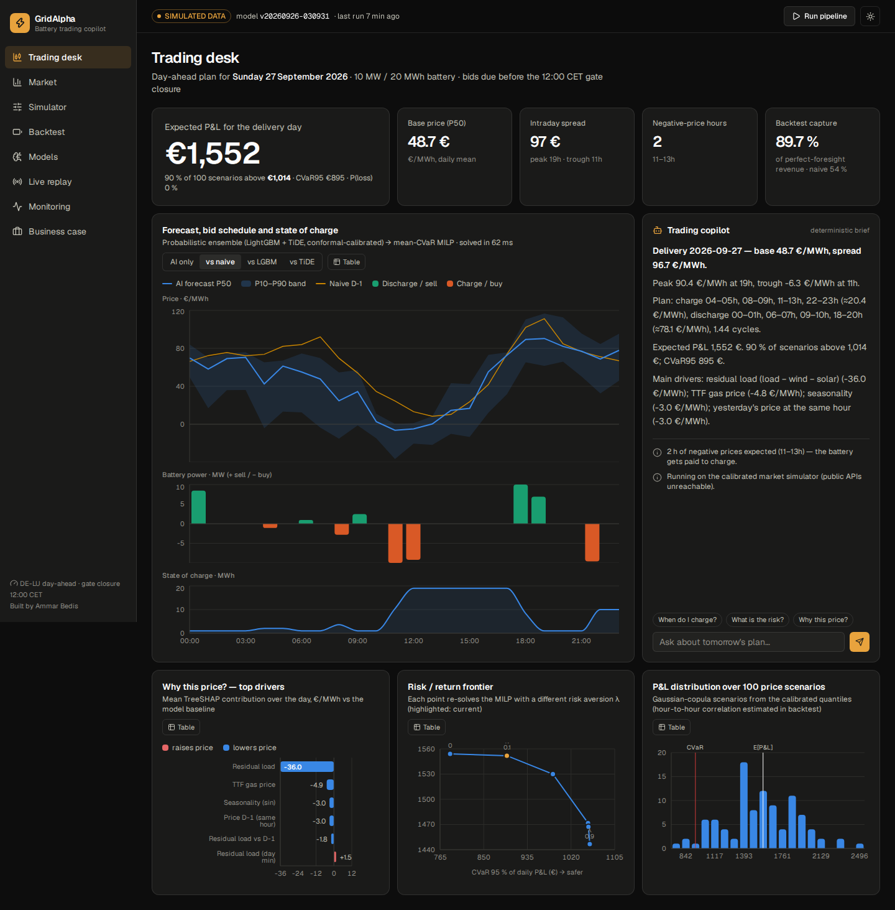
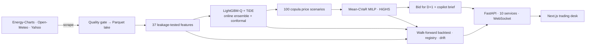

<div align="center">

# ⚡ GridAlpha

### AI copilot for battery-storage trading on the German power market

**Scraping → probabilistic forecasting (LightGBM + TiDE deep learning) → risk-aware optimisation (MILP + CVaR) → P&L measured in euros**
served by 10 FastAPI micro-services and a Next.js trading desk.




**[Version française](README.md)** · [Architecture](docs/ARCHITECTURE.md) · [Business case](docs/BUSINESS_CASE.md) · [Model card](docs/MODEL_CARD.md)

</div>

---

## 1. In 30 seconds

> German power prices can fall to **−250 €/MWh** at noon (solar glut) and exceed **150 €/MWh** in the evening. A battery earns money by
> buying low and selling high — but it must **commit the day before, before 12:00 CET**, without knowing tomorrow's prices.
> **GridAlpha automates that decision end to end**: it collects market data, forecasts the 24 next-day prices **with their uncertainty**,
> computes the optimal charge/discharge plan **under a risk constraint**, and measures its value in euros.

**Result (365-day walk-forward backtest, 10 MW / 20 MWh battery):** the AI strategy captures **89.7 %** of the theoretical maximum revenue
vs **54.1 %** for the naive practice → **+65.8 % revenue, ≈ +€225k per year**, with **20× fewer loss-making days**.

> ⚠️ **Data mode.** Figures in this README were produced with the **calibrated market simulator** (the build machine had no internet).
> On a connected machine the same pipeline scrapes **real data** (Energy-Charts, Open-Meteo, Yahoo) and **recomputes every KPI**
> (`backend/artifacts/reports/kpi_report.md`). The active mode is shown everywhere in the UI.

## 2. The business problem

| Market fact (Germany, DE-LU zone) | Value | Source |
|---|---|---|
| Negative-price hours, 2025 | **≈ 573 h** (record; 457 h in 2024) | Bloomberg / Montel |
| Average daily price spread, 2025 | **≈ 130 €/MWh** | FfE (EPEX Spot) |
| Lowest day-ahead price, 2025 | **−250 €/MWh** (11 May) | FfE |
| Grid-scale batteries, end 2025 | **2.4 GW / 3.5 GWh**, ~5.6 GW due 2026-27 | Modo Energy |
| All-in BESS capex outside China/US (Oct 2025) | **≈ $125/kWh** (large 4 h projects) | Ember |
| Perfect-foresight day-ahead arbitrage (1 MW / 2 h) | **≈ 61–85 k€/MW/yr** | arXiv 2608.08377; open benchmark |

Every day before gate closure the operator must fix 24 hourly positions blind. Mis-ranking the hours silently destroys value, and many
desks still schedule with simple rules ("tomorrow = today") in spreadsheets.

## 3. The solution



## 4. Results & KPIs (BO / DSO)

| ID | Objective | KPI | Target | Achieved |
|---|---|---|---|---|
| **BO1** | Capture the theoretical value | share of perfect-foresight revenue | ≥ 85 % (stretch 90 %) | **89.7 %** ✅ |
| **BO2** | Beat current practice (naive D-1) | revenue uplift | ≥ +15 % | **+65.8 % (+€225k/yr)** ✅ |
| **BO3** | Automate the daily loop | wall-clock ingest → bid · success rate | < 10 min · 100 % | **5–7 min · 100 %** ✅ |
| **BO4** | Control risk | share of loss-making days | ≤ 2 % | **0.8 %** (naive 15.9 %) ✅ |
| **BO5** | Inform the investment | measured revenue → NPV / IRR | reported | **56.8 k€/MW/yr · IRR 8.7 %** ✅ |
| **DSO1** | Accuracy | MAE reduction vs naive | ≥ 40 % | **−60.3 %** ✅ |
| **DSO2** | Reliable uncertainty | P10–P90 coverage | 75–85 % | **79.8 %** ✅ |
| **DSO3** | Rank the hours | mean Kendall τ per day | ≥ 0.75 | **0.768** (naive 0.489) ✅ |
| **DSO4** | Time the peak | peak hour within ±1 h | ≥ 80 % | **80.3 %** (naive 52 %) ✅ |
| **DSO5** | Real-time serving | API read p95 | < 150 ms | **8.8 ms** ✅ |
| **DSO6** | Fast decisions | MILP solve time | < 100 ms | **18 ms** ✅ |

## 5. Before → After: measured impact

> *Measured* = computed by the backtest or timed; *Estimated* = assumption about the manual process, to be confirmed in a company.

| Indicator | Before | After (GridAlpha) | Gain | Type |
|---|---|---|---|---|
| Annual revenue, 10 MW | €342k (naive D-1) | **€568k** | **+€225k/yr (+65.8 %)** | Measured |
| Share of maximum revenue captured | 54.1 % | **89.7 %** | **+35.6 pts** | Measured |
| Loss-making days per year | 58 | **3** | **÷ 20** | Measured |
| Worst day | −€1,704 | **−€307** | **−82 %** | Measured |
| Max drawdown | −€5,101 | **−€609** | **−88 %** | Measured |
| Error of announced vs realised P&L | €797 / day | **€6 / day** | **÷ 130** | Measured |
| Battery project economics (capex 180 €/kWh) | NPV −€1.6M · IRR −0.8 % | **NPV +€140k · IRR 8.7 % · payback 7.9 y** | not bankable → **bankable** | Measured |
| Daily data → forecast → plan → risk routine | ~2 h analyst work | **~6 min, unattended** | **≈ 20× faster** | Before estimated · after measured |
| Re-plan for another battery size / risk appetite | manual recalculation | **70 ms** API call | instant | Measured |
| One-year strategy backtest | days of work | **5–7 min** (14 retrains, 2,555 MILPs) | automated, reproducible | Measured |
| Forecast MAE | 36.9 €/MWh | **14.6 €/MWh** | **−60 %** | Measured |
| Error on price spikes | 66.4 €/MWh | **29.8 €/MWh** | **−55 %** | Measured |
| Negative-price hours detected | 63 % | **89 %** | **+26 pts** | Measured |
| P10–P90 reliability | 60.6 % (raw LightGBM) | **79.8 %** (target 80 %) | fixed by conformal | Measured |
| Interval width at ~80 % reliability | 126 €/MWh | **51 €/MWh** | **2.5× sharper** | Measured |
| Deep-model retraining | ~50 s from scratch | **~10 s** warm start | **≈ 5× faster** | Measured |
| LightGBM training (3 quantiles) | 10.2 s | **4.7 s** | **2.2× faster**, ~same accuracy | Measured |
| API read response | 340 ms (first compute) | **< 2 ms** (snapshot cache) | **≈ 150×** | Measured |
| False drift alarms | ≥ 5 "critical" features | **1** (a genuine weather anomaly) | seasonal reference + OOD score | Measured |

## 6. Key technical strengths
1. **Decision-first evaluation** — models ranked by the euros their schedule earns (capture ratio); ranking quality τ correlates 0.59 with
   captured value vs −0.22 for MAE.
2. **No look-ahead, proven by a test** that tampers with the future.
3. **Realistic walk-forward backtest** with expanding retraining, bids committed before gate closure, settled at realised prices.
4. **Calibrated uncertainty** — online expert ensemble + adaptive conformal prediction (80 % target, 79.8 % achieved).
5. **Exact optimisation under risk** — HiGHS MILP (binaries, warranty cycles, degradation) + Gaussian-copula scenarios + CVaR.
6. **Modern, frugal deep learning** — TiDE in PyTorch, monotone quantile head, seed ensemble, warm-start fine-tuning, laptop-CPU friendly.
7. **Production robustness** — blocking quality gate, retries, cache, simulator fallback never mixed with real data, champion/challenger registry,
   seasonal drift monitoring, scheduler before gate closure.
8. **Performance** — serverless Parquet + DuckDB lakehouse, snapshot-invalidated cache, ASGI latency middleware: **p95 8.8 ms**.
9. **Complete product** — 10 services, 35 endpoints, real-time WebSocket, 8-page light/dark responsive dashboard, CVD-validated charts with table views.
10. **Responsible GenAI** — the copilot writes from structured facts; the optional LLM may only rephrase, never invent a number.

## 7. Technologies
**Python 3.11** · **TypeScript** · httpx/tenacity (scraping) · **Parquet + DuckDB** · pandas/NumPy · **LightGBM** + TreeSHAP · **PyTorch (TiDE)** ·
conformal prediction · **SciPy `milp` / HiGHS** (MILP, CVaR) · **FastAPI** / Pydantic v2 / WebSocket / APScheduler / Typer · **Next.js 16** / React 19 /
**Tailwind v4** / TanStack Query / Recharts · Jupyter · **Docker Compose** · GitHub Actions · pytest (50 tests) · ruff.

## 8. Quick start
```powershell
# Windows
.\scripts\setup.ps1 ; .\scripts\run.ps1
```
```bash
# macOS / Linux / WSL
./scripts/setup.sh && ./scripts/run.sh
# or containers
docker compose up --build
```
Open **http://localhost:3000** (dashboard) and **http://localhost:8000/docs** (API). Full pipeline: `python -m gridalpha.cli run`
(365-day backtest) · scorecard: `python -m gridalpha.cli report`.

## 9. 🎯 For my CV

**GridAlpha — AI battery-trading copilot for the German power market** · *Python, LightGBM, PyTorch, SciPy/HiGHS, FastAPI, Next.js*

- Built an end-to-end system that **scrapes** the German day-ahead market (prices, generation, 8-site weather forecasts, gas), forecasts
  the **24 next-day prices as calibrated quantiles** (LightGBM + TiDE deep model, online ensemble, adaptive conformal prediction) and turns
  them into a **risk-aware battery schedule** solved as a **MILP with CVaR**.
- Walk-forward backtest over **365 days**: **89.7 %** of perfect-foresight revenue vs **54.1 %** for a naive desk schedule — **+66 % revenue
  (≈ +€225k/yr for a 10 MW battery)**, loss-making days cut from **58 to 3 per year**, worst day **−82 %**.
- Automated the daily bidding routine — from an estimated **~2 h of manual work to ~6 min** unattended; forecast error **−60 %**, 80 %
  prediction interval at **79.8 %** coverage.
- Shipped as **10 FastAPI services** (35 endpoints, WebSocket, **p95 8.8 ms**) and an 8-page **Next.js** trading desk; data-quality gate,
  drift monitoring, champion/challenger registry, daily scheduler, **50 tests** incl. a look-ahead-leakage test.

*Short version:* **GridAlpha — AI copilot for battery trading** — probabilistic price forecasting (LightGBM + TiDE, conformal) and MILP/CVaR
dispatch; **89.7 % of perfect-foresight revenue vs 54.1 % naive (+€225k/yr per 10 MW)**, daily routine **~2 h → 6 min**; FastAPI + Next.js, 50 tests.

> Replace the simulator figures with those of your live run (`kpi_report.md`), or keep the wording *"on a calibrated market simulator"*.

## 10. Limitations & roadmap
Hourly resolution (15-min MTU since Oct 2025), price-taker assumption, day-ahead only, risk level λ chosen on the backtest. Next: intraday
(XBID) and aFRR/FCR revenue stacking, 15-min products, bid curves, rainflow degradation model, battery fleets / VPP, metering & EMS data.

---
Data: Energy-Charts / Fraunhofer ISE (Bundesnetzagentur | SMARD.de, CC BY 4.0) · Open-Meteo (CC BY 4.0) · Yahoo Finance (optional). Research and
education project — no orders are placed on any exchange. MIT licence.

**Ammar Bedis** — Data Science & AI engineering student, ESPRIT (Tunis) · open to a final-year internship from January 2027 ·
[Portfolio](https://ammar-bedis.vercel.app) · [GitHub](https://github.com/badisAM) · [LinkedIn](https://linkedin.com/in/bedis-ammar-081431364)
