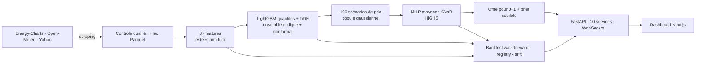
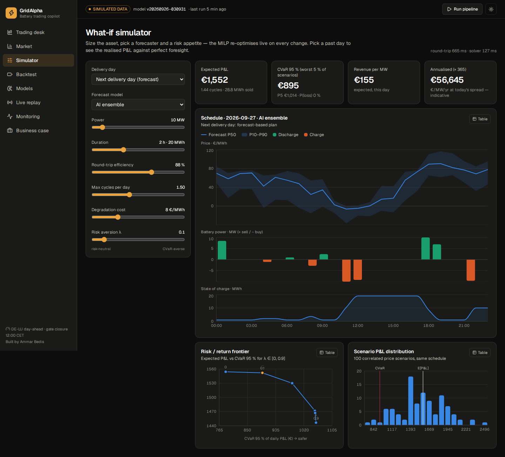
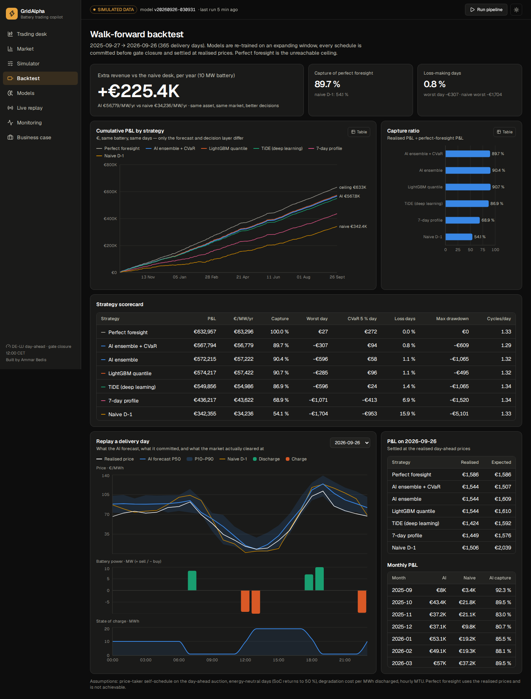
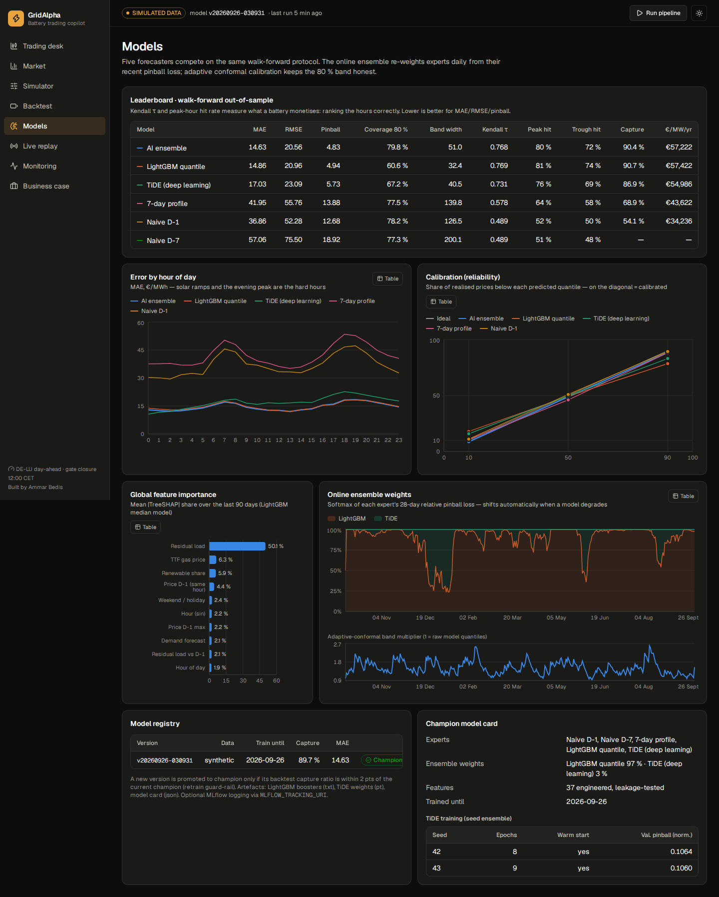
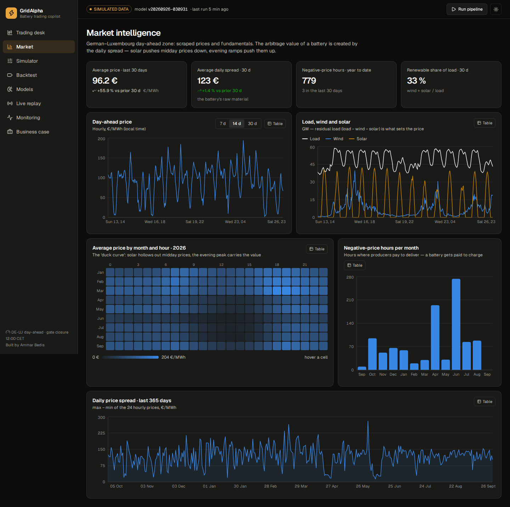
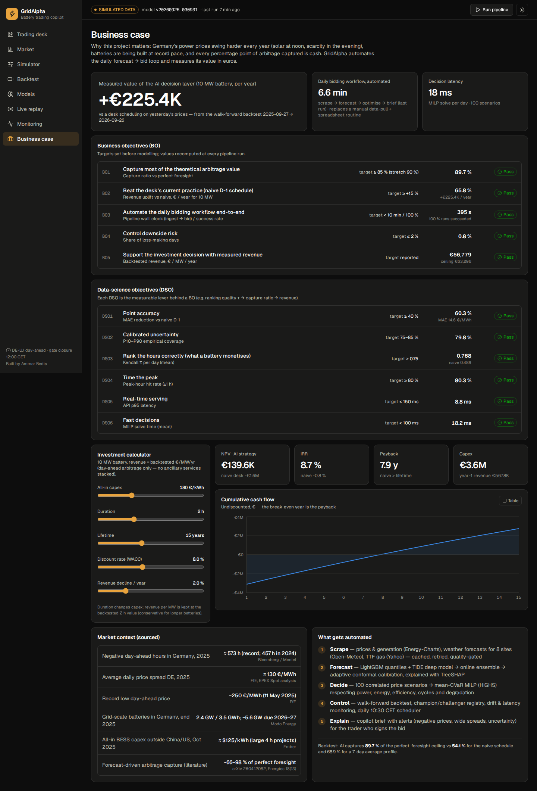

<div align="center">

# ⚡ GridAlpha

### Copilote IA pour le trading de batteries sur le marché électrique allemand

**Scraping → prévision probabiliste (LightGBM + deep learning TiDE) → optimisation sous risque (MILP + CVaR) → P&L mesuré en euros**
servi par 10 micro-services FastAPI et un dashboard de trading Next.js.


**[English version](README.en.md)** · [Architecture](docs/ARCHITECTURE.md) · [Business case](docs/BUSINESS_CASE.md) · [Model card](docs/MODEL_CARD.md)

</div>

---

## Sommaire
1. [Le projet en 30 secondes](#1-le-projet-en-30-secondes)
2. [Le problème métier](#2-le-problème-métier)
3. [La solution](#3-la-solution)
4. [Résultats & KPI (BO / DSO)](#4-résultats--kpi-bo--dso)
5. [Avant → Après : l'impact chiffré](#5-avant--après--limpact-chiffré)
6. [Valeur ajoutée par acteur](#6-valeur-ajoutée-par-acteur)
7. [Points forts techniques](#7-points-forts-techniques--ce-qui-en-fait-plus-quun-tp)
8. [Technologies](#8-technologies)
9. [Architecture & services](#9-architecture--services)
10. [Fonctionnalités (8 pages)](#10-fonctionnalités--8-pages)
11. [Démarrage rapide](#11-démarrage-rapide)
12. [Qualité & tests](#12-qualité--tests)
13. [🎯 Pour mon CV](#13--pour-mon-cv)
14. [Limites & feuille de route](#14-limites--feuille-de-route)
15. [Sources](#15-sources)

---

## 1. Le projet en 30 secondes

> En Allemagne, le prix de l'électricité peut tomber à **−250 €/MWh** à midi (trop de solaire) et dépasser **150 €/MWh** le soir.
> Une batterie gagne de l'argent en achetant bas et en revendant haut — mais elle doit **s'engager la veille avant 12 h**, sans connaître
> les prix. **GridAlpha automatise cette décision de bout en bout** : il collecte les données du marché, prévoit les 24 prix du lendemain
> **avec leur incertitude**, calcule le planning optimal de charge/décharge **en contrôlant le risque**, et mesure sa valeur en euros.

**Résultat (backtest walk-forward de 365 jours, batterie 10 MW / 20 MWh) :** la stratégie IA capte **89,7 %** du revenu maximal
théorique contre **54,1 %** pour la pratique naïve → **+65,8 % de revenu, soit ≈ +225 k€ par an**, avec **20 fois moins de jours
en perte**.

> ⚠️ **Mode de données.** Les chiffres de ce README ont été produits sur le **simulateur de marché calibré** (la machine de build
> n'avait pas accès à Internet). Sur un poste connecté, le même pipeline scrape les **vraies données** (Energy-Charts, Open-Meteo, Yahoo)
> et **recalcule automatiquement** tous les KPI (`backend/artifacts/reports/kpi_report.md`). Le mode actif est affiché partout dans l'UI.

---

## 2. Le problème métier

| Fait de marché (Allemagne, zone DE-LU) | Valeur | Source |
|---|---|---|
| Heures à prix négatif en 2025 | **≈ 573 h** (record ; 457 h en 2024) | Bloomberg / Montel |
| Écart moyen journalier des prix (max − min), 2025 | **≈ 130 €/MWh** | FfE (EPEX Spot) |
| Prix le plus bas de 2025 | **−250 €/MWh** (11 mai) | FfE |
| Batteries raccordées au réseau fin 2025 | **2,4 GW / 3,5 GWh**, ~5,6 GW prévus 2026-27 | Modo Energy |
| Coût d'un projet batterie (hors Chine/US, oct. 2025) | **≈ 125 $/kWh** (grands projets 4 h) | Ember |
| Valeur maximale de l'arbitrage day-ahead (1 MW / 2 h) | **≈ 61–85 k€/MW/an** | arXiv 2608.08377 ; benchmark open-source |

**Le défi :** chaque jour, avant la clôture de l'enchère (12 h CET), l'opérateur doit fixer 24 positions horaires sans connaître les prix.
Se tromper dans le **classement des heures** (charger à 10 h au lieu de 12 h, décharger à 18 h au lieu de 20 h) détruit la valeur en
silence. Beaucoup de desks planifient encore avec des règles simples (« demain = hier ») dans des tableurs.

**Qui paie pour ça :** propriétaires de batteries, agrégateurs / optimiseurs, desks de trading des énergéticiens, et les entreprises
énergie-tech (compteurs intelligents, EMS, réseaux).

---

## 3. La solution



1. **Collecte** — prix day-ahead, consommation, éolien, solaire (Energy-Charts), prévisions météo sur 8 sites allemands (Open-Meteo),
   prix du gaz TTF (Yahoo). Retries, cache brut, contrôle qualité, bascule automatique sur un simulateur calibré si une API tombe.
2. **Prévision probabiliste** — quantiles P10 / P50 / P90 pour les 24 heures, par LightGBM et par **TiDE** (deep learning, Google 2023),
   combinés par un **ensemble en ligne** et recalibrés par **conformal prediction adaptative**. Explications **TreeSHAP**.
3. **Décision** — 100 scénarios de prix corrélés → **programmation linéaire en nombres entiers (MILP)** avec contraintes physiques
   (puissance, énergie, rendement, cycles, usure) et **contrôle du risque CVaR**.
4. **Contrôle** — backtest walk-forward sur 365 jours, registry champion/challenger, drift, latence, scheduler quotidien à 10 h 30.
5. **Restitution** — API REST + WebSocket, dashboard 8 pages, **copilote** qui rédige le brief du jour et répond aux questions
   (LLM optionnel, jamais autorisé à inventer un chiffre).

---

## 4. Résultats & KPI (BO / DSO)

Objectifs fixés **avant** la modélisation ; valeurs **recalculées à chaque exécution** du pipeline
(365 jours, batterie 10 MW / 20 MWh, rendement 88 %, ≤ 1,5 cycle/jour, usure 8 €/MWh).

### Objectifs business (BO)

| ID | Objectif | KPI | Cible | Atteint | Statut |
|---|---|---|---|---|---|
| **BO1** | Capter l'essentiel de la valeur théorique | part du revenu « prévision parfaite » | ≥ 85 % (stretch 90 %) | **89,7 %** | ✅ |
| **BO2** | Battre la pratique actuelle (planning naïf J-1) | gain de revenu vs naïf | ≥ +15 % | **+65,8 % (+225 k€/an)** | ✅ |
| **BO3** | Automatiser le cycle quotidien de bout en bout | durée collecte → offre · taux de succès | < 10 min · 100 % | **5–7 min · 100 %** | ✅ |
| **BO4** | Maîtriser le risque | part de jours en perte | ≤ 2 % | **0,8 %** (naïf : 15,9 %) | ✅ |
| **BO5** | Éclairer la décision d'investissement | revenu mesuré → VAN / TRI | chiffré | **56,8 k€/MW/an · TRI 8,7 %** | ✅ |

### Objectifs data science (DSO)

| ID | Objectif | KPI | Cible | Atteint | Statut |
|---|---|---|---|---|---|
| **DSO1** | Précision | réduction de la MAE vs naïf | ≥ 40 % | **−60,3 %** (14,6 vs 36,9 €/MWh) | ✅ |
| **DSO2** | Incertitude fiable | couverture de l'intervalle P10–P90 | 75–85 % | **79,8 %** | ✅ |
| **DSO3** | Classer les heures (ce que la batterie monétise) | Kendall τ moyen par jour | ≥ 0,75 | **0,768** (naïf 0,489) | ✅ |
| **DSO4** | Trouver l'heure de pointe | heure du max à ±1 h | ≥ 80 % | **80,3 %** (naïf 52 %) | ✅ |
| **DSO5** | Service temps réel | latence API p95 (lectures) | < 150 ms | **8,8 ms** | ✅ |
| **DSO6** | Décision rapide | temps de résolution du MILP | < 100 ms | **18 ms** | ✅ |

### Classement des stratégies (même batterie, mêmes jours)

| Stratégie | Capture | €/MW/an | Pire journée | Jours en perte |
|---|---|---|---|---|
| Prévision parfaite (plafond inatteignable) | 100 % | 63 296 | +27 € | 0 % |
| **GridAlpha — ensemble IA + CVaR** | **89,7 %** | **56 779** | **−307 €** | **0,8 %** |
| LightGBM seul | 90,7 % | 57 422 | −285 € | 1,1 % |
| TiDE (deep learning) seul | 86,9 % | 54 986 | −596 € | 1,4 % |
| Profil moyen 7 jours | 68,9 % | 43 622 | −1 071 € | 6,9 % |
| Naïf J-1 (pratique manuelle courante) | 54,1 % | 34 236 | −1 704 € | 15,9 % |

---

## 5. Avant → Après : l'impact chiffré

> Même logique que « rapports : 2 h → 2 min » : chaque ligne compare la pratique de référence à GridAlpha.
> **Mesuré** = calculé par le backtest ou chronométré ; **Estimé** = hypothèse sur le processus manuel, à confirmer en entreprise.

### Impact business (batterie 10 MW, 365 jours)

| Indicateur | Avant (planning naïf J-1) | Après (GridAlpha) | Gain | Nature |
|---|---|---|---|---|
| Revenu annuel | 342 k€ | **568 k€** | **+225 k€ / an (+65,8 %)** | Mesuré |
| Part du revenu maximal captée | 54,1 % | **89,7 %** | **+35,6 points** | Mesuré |
| Jours en perte par an | 58 jours | **3 jours** | **÷ 20** | Mesuré |
| Pire journée | −1 704 € | **−307 €** | **−82 %** | Mesuré |
| Pire perte cumulée (max drawdown) | −5 101 € | **−609 €** | **−88 %** | Mesuré |
| Erreur du P&L annoncé vs réalisé | 797 € / jour | **6 € / jour** | **÷ 130** — le P&L prévu devient fiable | Mesuré |
| Rentabilité du projet batterie (capex 180 €/kWh) | VAN −1,6 M€ · TRI −0,8 % · jamais rentabilisé | **VAN +140 k€ · TRI 8,7 % · retour en 7,9 ans** | projet **non finançable → finançable** | Mesuré (modèle financier) |

### Impact opérationnel (automatisation)

| Tâche quotidienne | Avant | Après | Gain | Nature |
|---|---|---|---|---|
| Collecte + prévision + planning + contrôle du risque | ~2 h d'analyste (tableurs) | **~6 min, sans intervention** | **≈ 20× plus rapide** | Avant : estimé · Après : mesuré (297–395 s) |
| Re-planifier pour une autre taille de batterie / appétit au risque | recalcul manuel | **70 ms** (appel API) | instantané | Mesuré (p50) |
| Backtester une stratégie sur 1 an | plusieurs jours de travail | **5–7 min** (14 ré-entraînements, 2 555 optimisations) | automatique et reproductible | Mesuré |
| Marge avant la clôture de 12 h | variable | **90 min** (run à 10 h 30) | zéro offre manquée | Configuré |

### Impact data science & ingénierie

| Indicateur | Avant | Après | Gain | Nature |
|---|---|---|---|---|
| Erreur de prévision (MAE) | 36,9 €/MWh (naïf) | **14,6 €/MWh** | **−60 %** | Mesuré |
| Erreur sur les pics de prix | 66,4 €/MWh | **29,8 €/MWh** | **−55 %** | Mesuré |
| Détection des heures à prix négatif | 63 % | **89 %** | **+26 points** | Mesuré |
| Fiabilité de l'intervalle P10–P90 | 60,6 % (LightGBM brut) | **79,8 %** (cible 80 %) | calibration corrigée par conformal | Mesuré |
| Largeur de l'intervalle à fiabilité égale (~80 %) | 126 €/MWh (naïf) | **51 €/MWh** | **2,5× plus précis** | Mesuré |
| Ré-entraînement du modèle deep learning | ~50 s (from scratch) | **~10 s** (warm start) | **≈ 5× plus rapide** | Mesuré |
| Entraînement LightGBM (3 quantiles) | 10,2 s | **4,7 s** | **2,2× plus rapide** à précision quasi égale | Mesuré |
| Réponse API (lecture) | 340 ms (1ᵉʳ calcul) | **< 2 ms** (cache sur snapshot) | **≈ 150×** | Mesuré |
| Fausses alertes de drift | ≥ 5 features « critiques » (référence annuelle) | **1** (vraie anomalie météo) | référence saisonnière + score hors-distribution | Mesuré |

---

## 6. Valeur ajoutée par acteur

| Pour… | GridAlpha apporte |
|---|---|
| **Le trader** | un plan prêt à signer à 10 h 30, avec fourchette de prix, P&L attendu, risque (CVaR), alertes (prix négatifs, forte incertitude) et **explication du pourquoi** (SHAP) |
| **Le propriétaire de la batterie** | +65 % de revenu vs la pratique naïve, 20× moins de jours en perte, usure maîtrisée (cycles plafonnés, coût de dégradation dans l'optimisation) |
| **L'investisseur** | un revenu **mesuré** (pas supposé) qui alimente VAN / TRI / payback — la couche de décision rend le projet finançable |
| **L'équipe data / IT** | pipeline reproductible, tests anti-fuite, registry, monitoring, API documentée, déploiement Docker, CI |
| **Le risk manager** | un seul curseur λ qui arbitre gain attendu vs pire scénario, avec la frontière rendement/risque affichée |

---

## 7. Points forts techniques — ce qui en fait plus qu'un TP

1. **Évaluer la décision, pas seulement la prévision** — chaque modèle est jugé sur les **euros** que son planning rapporte
   (capture ratio), pas seulement sur la MAE. Constat mesuré : le classement des heures (τ) explique le gain (corrélation 0,59) bien
   mieux que la MAE (−0,22).
2. **Zéro fuite d'information, prouvé par un test** — ensemble d'information explicite à la clôture ; un test unitaire modifie le futur
   et vérifie qu'aucune feature ne bouge.
3. **Backtest walk-forward réaliste** — ré-entraînement tous les 28 jours sur fenêtre croissante, offre engagée avant la clôture,
   règlement au prix réel, plafond « prévision parfaite » comme référence.
4. **Incertitude calibrée** — ensemble d'experts pondéré en ligne + **conformal prediction adaptative** : 80 % visés, 79,8 % obtenus.
5. **Optimisation exacte sous risque** — MILP HiGHS avec binaires (pas de charge/décharge simultanée), cycles de garantie, usure,
   scénarios par copule gaussienne et **CVaR** (Rockafellar–Uryasev).
6. **Deep learning moderne et frugal** — TiDE (Google, 2023) en PyTorch : covariables futures, tête quantile monotone, ensemble de seeds,
   **fine-tuning warm start** ; tourne sur CPU de laptop.
7. **Robustesse de production** — contrôle qualité bloquant, retries, cache, bascule simulateur jamais mélangée au réel,
   registry **champion/challenger**, drift saisonnier, scheduler avant la clôture.
8. **Performance** — lac Parquet + DuckDB sans serveur, cache invalidé par snapshot, middleware ASGI de latence : **p95 8,8 ms**.
9. **Produit complet** — 10 services, 35 endpoints, WebSocket temps réel, dashboard 8 pages clair/sombre, responsive, palette
   validée daltonisme, vue tableau pour chaque graphique.
10. **IA générative responsable** — le copilote rédige à partir de faits structurés ; le LLM (optionnel, Ollama/OpenAI-compatible) ne
    peut que reformuler, jamais inventer un chiffre.

---

## 8. Technologies

| Couche | Technologies | Pourquoi ce choix |
|---|---|---|
| Langages | **Python 3.11**, **TypeScript** | écosystème ML + front typé |
| Collecte | httpx, tenacity, APIs Energy-Charts / Open-Meteo / Yahoo | scraping robuste avec retries et cache |
| Stockage | **Parquet + DuckDB** (lakehouse) | SQL colonnaire sans serveur, lectures sans verrou |
| Features | pandas, NumPy, holidays | 37 features, gestion heure d'été/hiver |
| Machine learning | **LightGBM** (régression quantile), **TreeSHAP** | ordre de mérite non linéaire, explicabilité native |
| Deep learning | **PyTorch** — **TiDE** | multi-horizon avec covariables futures, rapide sur CPU |
| Incertitude | ensemble en ligne, **conformal prediction adaptative**, copule gaussienne | intervalles fiables même en changement de régime |
| Optimisation | **SciPy `milp` + HiGHS**, CVaR | optimum prouvé en ~20 ms, contraintes auditables |
| Backend | **FastAPI**, Pydantic v2, Uvicorn, WebSocket, APScheduler, Typer | API typée + docs OpenAPI, temps réel, planification |
| MLOps | registry champion/challenger, PSI saisonnier, monitoring, MLflow optionnel, GitHub Actions | modèles gouvernés et surveillés |
| Frontend | **Next.js 16**, React 19, **Tailwind CSS v4**, TanStack Query, Recharts, lucide | dashboard moderne, rapide, accessible |
| Notebooks | Jupyter, matplotlib | 3 analyses exécutées et reproductibles |
| DevOps | **Docker Compose** (4 services), scripts PowerShell & Bash, Makefile | lancement en une commande |
| Qualité | **pytest (50 tests)**, ruff, TypeScript strict | tests anti-fuite, physique de la batterie, API bout-en-bout |

---

## 9. Architecture & services

| Service | Rôle | Endpoints principaux |
|---|---|---|
| `system` | santé, configuration, orchestration du pipeline | `/health`, `/pipeline/run` |
| `market` | données de marché scrapées, statistiques, courbe « duck » | `/market/summary`, `/market/profile` |
| `forecast` | quantiles du lendemain par modèle, explications SHAP | `/forecast/latest`, `/forecast/explain` |
| `trading` | planning engagé, optimisation à la demande, frontière de risque | `/trading/plan`, `/trading/optimize` |
| `backtest` | P&L walk-forward, rejouer un jour | `/backtest/equity`, `/backtest/day/{date}` |
| `models` | registry, leaderboard, calibration | `/models/leaderboard`, `/models/calibration` |
| `monitoring` | drift, qualité des données, latence, runs | `/monitoring/drift`, `/monitoring/latency` |
| `copilot` | brief du jour, questions-réponses | `/copilot/brief`, `/copilot/ask` |
| `business` | scorecard BO/DSO, calculateur VAN/TRI | `/business/kpis`, `/business/investment` |
| `stream` | replay temps réel du desk | `WS /ws/replay` |

+ 3 processus : **pipeline** (job), **scheduler** (10 h 30 chaque jour), **web** (Next.js). Détails et 11 décisions d'architecture (ADR) :
[`docs/ARCHITECTURE.md`](docs/ARCHITECTURE.md).

---

## 10. Fonctionnalités — 8 pages

| Trading desk | Simulateur | Backtest |
|---|---|---|
|  |  |  |
| **Modèles** | **Marché** | **Business case** |
|  |  |  |

- **Trading desk** — plan du lendemain (bande P10–P90, charge/décharge, état de charge), P&L attendu, CVaR, copilote, drivers SHAP.
- **Marché** — prix, fondamentaux, heatmap « duck curve », heures négatives, spreads.
- **Simulateur** — taille de batterie, rendement, cycles, usure, λ de risque → ré-optimisation en direct ; jours passés avec P&L réel.
- **Backtest** — P&L cumulé par stratégie, capture ratio, scorecard, replay d'une journée.
- **Modèles** — leaderboard, erreur par heure, calibration, importance SHAP, poids de l'ensemble, registry.
- **Live replay** — flux WebSocket heure par heure avec carnet d'ordres.
- **Monitoring** — runs du pipeline, qualité des données, drift, dérive de performance, latence par route.
- **Business case** — BO/DSO, calculateur d'investissement, contexte marché sourcé.

---

## 11. Démarrage rapide

**Prérequis :** Python ≥ 3.10, Node ≥ 20.9 (ou Docker). Premier lancement ≈ 3 min.

**Windows (PowerShell)**
```powershell
Set-ExecutionPolicy -Scope CurrentUser RemoteSigned   # une fois, si les scripts sont bloqués
.\scripts\setup.ps1      # venv + PyTorch CPU + dépendances + npm ci
.\scripts\run.ps1        # pipeline (1re fois) + API :8000 + site :3000
```

**macOS / Linux / WSL**
```bash
./scripts/setup.sh
./scripts/run.sh         # --refresh pour relancer le pipeline
```

**Docker**
```bash
docker compose up --build
```

Puis **http://localhost:3000** (dashboard) et **http://localhost:8000/docs** (API interactive).

| Commande | Effet |
|---|---|
| `python -m gridalpha.cli run --quick` | pipeline complet avec backtest 90 jours (~3 min) |
| `python -m gridalpha.cli run` | backtest 365 jours (5–10 min) |
| `python -m gridalpha.cli report` | affiche la scorecard BO/DSO |
| `python -m gridalpha.cli schedule` | exécution quotidienne à 10 h 30 (Europe/Berlin) |
| `make test` · `make notebooks` · `make bench` | tests · notebooks · benchmark de latence |

Configuration dans `.env` (voir [`.env.example`](.env.example)) : mode de données, taille de batterie, rendement, cycles, usure, aversion au
risque, horizon du backtest, LLM optionnel.

```
backend/    gridalpha/ (data · features · models · trading · backtest · monitoring · copilot · finance · api) · tests/
frontend/   src/app (8 pages) · src/components · src/lib (client API typé, hooks)
notebooks/  01 EDA marché · 02 modèles de prévision · 03 trading & backtest (exécutés)
docs/       ARCHITECTURE · BUSINESS_CASE · MODEL_CARD · screenshots
scripts/    setup/run (PowerShell + Bash) · benchmark.py
```

---

## 12. Qualité & tests

| Élément | Détail |
|---|---|
| **50 tests** (15 s) | anti-fuite, physique de la batterie (SoC, rendement, cycles, pas de charge/décharge simultanée), calibration conformal, PSI, finance, **pipeline + API bout-en-bout**, WebSocket |
| Compatibilité | testé pandas 2.2 → 3.0, NumPy 1.26 → 2.4, avec et sans PyTorch |
| Lint | ruff (backend), TypeScript strict (frontend) |
| CI | GitHub Actions : lint + tests + build du front, sans accès réseau (mode simulé) |
| Reproductibilité | seeds fixés, snapshot du lac, version du modèle tracée dans chaque prévision |

---

## 13. 🎯 Pour mon CV

> Les chiffres ci-dessous viennent du **simulateur calibré**. Après un lancement en mode live (`python -m gridalpha.cli run`), remplace-les
> par ceux de `kpi_report.md` — ou garde la mention *« on a calibrated market simulator »*.

### Version complète (anglais — même format que le CV)

**GridAlpha — AI battery-trading copilot for the German power market** · *Python, LightGBM, PyTorch, SciPy/HiGHS, FastAPI, Next.js*

- Built an end-to-end system that **scrapes** the German day-ahead market (prices, generation, 8-site weather forecasts, gas), forecasts
  the **24 next-day prices as calibrated quantiles** (LightGBM + TiDE deep model, online ensemble, adaptive conformal prediction) and
  turns them into a **risk-aware battery schedule** solved as a **MILP with CVaR**.
- Walk-forward backtest over **365 days**: captures **89.7 %** of perfect-foresight revenue vs **54.1 %** for a naive desk schedule —
  **+66 % revenue (≈ +€225k/yr for a 10 MW battery)**, loss-making days cut from **58 to 3 per year**, worst day **−82 %**.
- Automated the daily bidding routine end to end — from an estimated **~2 h of manual work to ~6 min** unattended, 90 min before gate
  closure; forecast error **−60 %**, 80 % prediction interval hitting **79.8 %** coverage.
- Shipped as **10 FastAPI services** (35 endpoints, WebSocket, **p95 8.8 ms**) and an 8-page **Next.js** trading desk; MLOps with
  data-quality gate, seasonal drift monitoring, champion/challenger registry, daily scheduler and **50 tests** incl. a look-ahead-leakage test.

### Version courte (section « Selected projects », 2 lignes)

**GridAlpha — AI copilot for battery trading** — Probabilistic price forecasting (LightGBM + TiDE, conformal) and MILP/CVaR dispatch;
**89.7 % of perfect-foresight revenue vs 54.1 % naive (+€225k/yr per 10 MW)**, daily routine **~2 h → 6 min**; FastAPI + Next.js, 50 tests.

### Version française (CV / portfolio FR)

**GridAlpha — Copilote IA de trading de batteries (marché électrique allemand)** · *Python, LightGBM, PyTorch, HiGHS, FastAPI, Next.js*

- Conception d'un système de bout en bout : **scraping** du marché day-ahead, **prévision probabiliste** des 24 prix du lendemain
  (LightGBM + TiDE, ensemble en ligne, conformal prediction) et **optimisation sous risque** du planning de la batterie (MILP + CVaR).
- Backtest walk-forward sur **365 jours** : **89,7 %** du revenu maximal capté contre **54,1 %** en pratique naïve —
  **+66 % de revenu (≈ +225 k€/an pour 10 MW)**, jours en perte **÷ 20**.
- Automatisation du cycle quotidien : **~2 h de travail manuel → ~6 min** sans intervention ; erreur de prévision **−60 %**.
- Livré en **10 micro-services FastAPI** (p95 **8,8 ms**) + dashboard **Next.js** 8 pages ; MLOps (qualité des données, drift, registry,
  scheduler) et **50 tests** dont un test anti-fuite de données.

### Mots-clés (ATS / LinkedIn)
`Time Series Forecasting` · `Probabilistic Forecasting` · `Quantile Regression` · `LightGBM` · `PyTorch` · `TiDE` · `Conformal Prediction` ·
`Mathematical Optimization` · `MILP` · `CVaR` · `Stochastic Optimization` · `Backtesting` · `Energy Trading` · `Battery Storage (BESS)` ·
`Web Scraping` · `DuckDB` · `FastAPI` · `WebSocket` · `Next.js` · `TypeScript` · `MLOps` · `Model Monitoring` · `Docker` · `CI/CD` · `SHAP`

### Post LinkedIn (prêt à publier)
> ⚡ Nouveau projet : **GridAlpha**, un copilote IA pour le trading de batteries sur le marché électrique allemand.
> En 2025, l'Allemagne a connu ~573 heures à prix négatif : les batteries peuvent être *payées* pour se charger… à condition de décider
> la veille avant midi. GridAlpha prévoit les prix du lendemain avec leur incertitude (LightGBM + deep learning TiDE + conformal prediction),
> puis optimise la batterie sous contrainte de risque (MILP + CVaR).
> 📈 Backtest 365 jours : 89,7 % du revenu maximal capté vs 54,1 % en pratique naïve (+66 %), et un cycle quotidien passé de ~2 h à ~6 min.
> Stack : Python · PyTorch · LightGBM · HiGHS · FastAPI · Next.js · Docker. Code et démo 👉 [lien GitHub]

### Ce que je sais défendre en entretien
| Question | Réponse courte |
|---|---|
| Pourquoi pas juste la MAE ? | La batterie monétise l'**ordre** des heures : τ corrèle 0,59 avec le gain, la MAE seulement −0,22. |
| Comment évites-tu la fuite de données ? | Ensemble d'information à la clôture + test qui modifie le futur et vérifie que rien ne bouge. |
| Pourquoi un MILP et pas du RL ? | 24 pas de temps, contraintes explicites : optimum prouvé en 18 ms, auditable par un trader. |
| Pourquoi TiDE ? | Covariables futures (météo prévue) sur les 24 h en une passe, entraînement en secondes sur CPU. |
| Qu'apporte le CVaR ? | −0,7 point de capture pour une pire journée divisée par 2 et moins d'usure. |
| Limites ? | Pas de 15 min, pas d'intraday ni de services système, hypothèse price-taker → suite naturelle d'un PFE. |

---

## 14. Limites & feuille de route
- **Limites actuelles :** résolution horaire (le marché est au pas de 15 min depuis oct. 2025), hypothèse *price-taker*, day-ahead uniquement ;
  λ de risque choisi sur le backtest (à valider sur une année séparée).
- **Suite (PFE) :** intraday (XBID) + réserves aFRR/FCR (empilement de revenus), produits 15 min, courbes d'offres, modèle de
  dégradation (rainflow), flotte de batteries / VPP, couplage avec données de compteurs et EMS.

---

## 15. Sources
[Montel — heures négatives 2024-2025](https://montel.energy/commentary/from-negative-prices-to-zero-hours-the-new-challenge-for-energy-investors-in-germany) ·
[FfE — prix EPEX Spot 2025](https://www.ffe.de/en/publications/german-electricity-prices-on-the-epex-spot-exchange-in-2025/) ·
[Modo Energy — batteries en Allemagne](https://modoenergy.com/research/en/de-germany-bess-batteries-buildout-capacity-growth-installation-grid-scale-february-2026) ·
[Ember — coût du stockage](https://ember-energy.org/latest-insights/how-cheap-is-battery-storage/) ·
[arXiv 2604.12082 — corrélation de rang et valeur d'arbitrage](https://arxiv.org/abs/2604.12082) ·
[Energies 18(13) — méthodes de prévision et profit des batteries](https://doi.org/10.3390/en18133309) ·
[Energy-Charts API](https://api.energy-charts.info/) · [Open-Meteo](https://open-meteo.com/)

Données : Energy-Charts / Fraunhofer ISE (Bundesnetzagentur | SMARD.de, CC BY 4.0) · Open-Meteo (CC BY 4.0) · Yahoo Finance (cotations publiques,
optionnel). Projet de recherche et d'apprentissage : aucun ordre n'est passé sur une bourse. Licence MIT.

---

<div align="center">

**Ammar Bedis** — élève ingénieur Data Science & IA, ESPRIT (Tunis) · ouvert à un PFE à partir de janvier 2027

[Portfolio](https://ammar-bedis.vercel.app) · [GitHub](https://github.com/badisAM) · [LinkedIn](https://linkedin.com/in/bedis-ammar-081431364)

</div>
