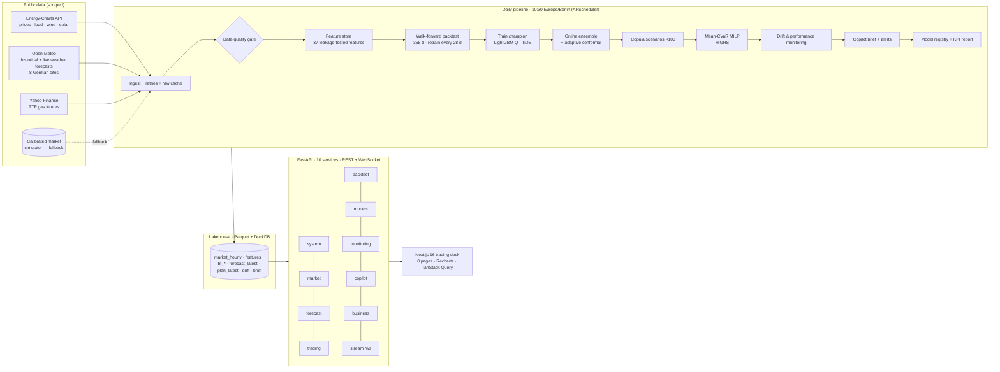

# Architecture & key decisions

GridAlpha is a **decision system**, not a forecasting notebook: its output is a committed battery schedule whose value is measured in euros.
Every design choice below follows from three values:

| Key value | What it means in the code |
|---|---|
| **Decision-first** | Models are ranked by the money their schedule earns (capture ratio), not only by MAE. Kendall τ and peak-hour hit rate are first-class metrics. |
| **No look-ahead, ever** | An explicit information set at gate closure (D-1 12:00 CET), enforced by a unit test that perturbs the future. Walk-forward backtest with expanding-window retraining. |
| **Honest by construction** | Baselines are shown next to every model; the data mode (live vs simulated) is visible in the API and the UI; KPI scorecard targets are fixed and recomputed on every run; no LLM ever produces a number. |
| **Runs on a laptop** | Zero infrastructure: Parquet + DuckDB instead of a DB server, CPU-only PyTorch, MILP solved in ~20 ms. One command for the full stack. |
| **Operable** | Scheduler before gate closure, data-quality gate, drift + performance monitoring, model registry with champion guard-rail, latency telemetry. |

---

## 1. System overview



### Services

| Service | Endpoints | Responsibility |
|---|---|---|
| `system` | `GET /health`, `GET /system/config`, `POST /pipeline/run`, `GET /pipeline/status` | health, config, orchestration (single-flight lock) |
| `market` | `/market/summary`, `/prices`, `/daily`, `/profile` | scraped market data & statistics (duck-curve heatmap) |
| `forecast` | `/forecast/latest`, `/explain`, `/history` | next-day quantiles per model, TreeSHAP explanations |
| `trading` | `GET /trading/plan`, `POST /trading/optimize`, `POST /trading/frontier` | committed bid; on-demand MILP for any asset / risk level / past day |
| `backtest` | `/backtest/summary`, `/equity`, `/daily`, `/monthly`, `/weights`, `/days`, `/day/{date}` | walk-forward P&L and day replay |
| `models` | `/models`, `/leaderboard`, `/error-by-hour`, `/calibration`, `/importance` | registry, evaluation, reliability |
| `monitoring` | `/monitoring/drift`, `/data-quality`, `/latency`, `/pipeline` | observability |
| `copilot` | `GET /copilot/brief`, `POST /copilot/ask` | grounded brief & Q&A (optional LLM) |
| `business` | `GET /business/kpis`, `POST /business/investment` | BO/DSO scorecard, NPV/IRR/payback |
| `stream` | `WS /ws/replay` | real-time replay of the trading desk |

Plus three runtime processes: **pipeline** (one-shot job), **scheduler** (daily cron), **web** (Next.js).

### Repository layout

```
backend/gridalpha/
  config.py            12-factor settings (GRIDALPHA_* env vars)
  timeutils.py         delivery days, DST-safe, gate closure
  data/                sources/ (energy_charts, open_meteo, yahoo_fuel, synthetic) · ingest · quality · lake
  features/builder.py  information-set-aware feature engineering
  models/              baselines · lgbm (quantile + SHAP) · tide (PyTorch) · ensemble (online + ACI) · metrics · registry
  trading/             battery MILP (deterministic + CVaR) · copula scenarios · planner
  backtest/            walk-forward engine · BO/DSO scorecard + markdown report
  monitoring/drift.py  seasonal PSI · out-of-range share · rolling error/coverage
  copilot/brief.py     deterministic brief + alerts, optional LLM rewrite
  finance/investment.py NPV / IRR / payback
  pipeline.py · scheduler.py · cli.py
  api/                 main (middleware, lifespan) · deps (cache, latency) · schemas · routers/
backend/tests/         leakage, optimiser physics, calibration, API end-to-end (50 tests)
frontend/src/app/      8 pages: desk · market · simulator · backtest · models · live · monitoring · business
notebooks/             01 market EDA · 02 forecasting models · 03 trading & backtest
```

---

## 2. Architecture decision records (ADR)

### ADR-001 · Evaluate the decision, not only the forecast
**Context.** A battery monetises the *ordering* of hours (buy the cheapest, sell the dearest). Two forecasts with the same MAE can earn very different money.
**Decision.** Every forecaster feeds the same optimiser and is settled at realised prices; the headline KPI is the **capture ratio** (realised P&L ÷ perfect-foresight P&L). Kendall τ per day, peak/trough-hour hit rates and pinball loss are reported alongside MAE.
**Consequence.** Model selection aligns with business value; recent literature confirms rank correlation predicts arbitrage value better than MAE (arXiv:2604.12082).

### ADR-002 · Lakehouse on Parquet + DuckDB instead of a database server
**Context.** One writer (pipeline) and one reader (API) in different processes; the target is a student laptop and a recruiter's `git clone`.
**Decision.** Each table is a Parquet file replaced atomically (`os.replace`); DuckDB provides SQL over the files in-process; the API memoises reads on file mtime.
**Consequence.** Lock-free snapshot reads, columnar speed, zero install. Migration path: the `Lake` class is the only storage adapter (swap for TimescaleDB/S3 + Iceberg when multi-user).

### ADR-003 · Explicit information set + leakage test
Features for delivery day D only use: prices ≤ D-1 (published D-2 ~12:45), generation/load lagged ≥ 48 h, weather **forecasts** (historical-forecast archive, not observations), TTF lagged 2 days. Fleet capacity for solar/wind is estimated online (rolling actual ÷ weather ratio), so the features track capacity growth without future knowledge. `test_no_lookahead_leakage` multiplies all post-cut-off prices and actuals and asserts identical features.

### ADR-004 · Hourly resolution
Since 1 Oct 2025 SDAC clears in 15-minute MTUs. The pipeline aggregates to hourly means for robustness and speed; the optimiser is resolution-agnostic (`dt` argument). Moving to 15-min is a data-granularity change, not an architecture change (roadmap).

### ADR-005 · LightGBM quantile + TiDE + online ensemble + adaptive conformal
* **LightGBM quantile** (P10/P50/P90, recency-weighted): the merit order is piecewise-linear in residual load — trees capture it natively; trains in seconds; exact TreeSHAP for free.
* **TiDE** (Das et al., 2023): MLP encoder–decoder consuming *known-future covariates* for all 24 hours at once, RevIN normalisation, monotone quantile head, pinball loss, seed ensemble, **warm-start fine-tuning** between walk-forward blocks (5× faster retrains). Chosen over LSTM/Transformers for CPU cost and native covariate handling.
* **Online ensemble**: softmax of each expert's recent relative pinball loss (only settled days → leakage-free).
* **Adaptive conformal inference** (Gibbs & Candès, 2021): the band is rescaled daily from realised miss rates → coverage stays at 80 % under regime shifts without retraining (raw GBM quantiles cover ~60 %).

### ADR-006 · Exact MILP (HiGHS) instead of heuristics or RL
**Decision.** Mixed-integer LP: SoC dynamics with efficiency, power/energy bounds, no simultaneous charge/discharge (binaries), warranty cycle cap, energy-neutral day, degradation cost per MWh. Solved by HiGHS through `scipy.optimize.milp`.
**Why.** Provably optimal for the given prices, ~20 ms, every constraint auditable by a trader or an asset owner. RL would need a simulator and gives no optimality guarantee for a 24-step deterministic problem.

### ADR-007 · Risk-aware bidding with CVaR
100 correlated scenarios (Gaussian copula; split-normal marginals reproduce P10/P50/P90 exactly; hour-to-hour correlation ρ estimated from standardised backtest residuals) evaluate one non-anticipative schedule. Objective `(1-λ)·E[−P&L] + λ·CVaR95[−P&L]` (Rockafellar–Uryasev linearisation). λ is a business knob exposed in the UI; the default sits at the knee of the backtest frontier.

### ADR-008 · Calibrated simulator as a fallback, never mixed with real data
If a core API is unreachable (firewall, rate limit, offline demo, CI), the whole dataset switches to a fundamental simulator (weather → renewables → residual load → merit order with gas/CO₂ costs), calibrated on 2025 DE-LU statistics. Real and synthetic series are never mixed; the mode is shown in `/health`, every page header and the copilot alerts.

### ADR-009 · FastAPI + Next.js
* **FastAPI**: typed contracts (Pydantic v2 → OpenAPI at `/docs`), async WebSocket, threadpool for CPU-bound solves, pure-ASGI latency middleware (`Server-Timing` header), GZip, lake-aware memo cache (invalidated by file mtime, no TTL guessing).
* **Next.js 16 (App Router) + TypeScript + Tailwind v4 + TanStack Query + Recharts**: same-origin API proxy via rewrites (no CORS in the browser), `keepPreviousData` (no skeleton flash), charts on a CVD-validated palette with a table-view twin for accessibility, light/dark themes.

### ADR-010 · Copilot: deterministic first, LLM optional and grounded
The brief is generated from a structured *facts* object (prices, windows, P&L, CVaR, SHAP drivers). An LLM (any OpenAI-compatible endpoint — Ollama locally) may only rephrase those facts; Q&A answers are grounded on the same object. Numbers can therefore never be hallucinated.

### ADR-011 · MLOps guard-rails
* **Data-quality gate** (coverage, physical ranges, staleness, gaps) blocks the run on failure.
* **Registry**: versioned artefacts + model card; a new version becomes champion only if its capture ratio is within 2 pts of the current one.
* **Drift**: PSI against a *seasonally matched* reference (same calendar window in previous years) for weather/fundamental features; out-of-training-range share for level variables (gas, price) — trees cannot extrapolate. Retraining is triggered by **performance** drift (7-day MAE > 1.6× backtest average), not by PSI alone.

---

## 3. Performance budget (measured — see `artifacts/reports/`)

| Stage | Budget | Measured (2-vCPU cloud VM) |
|---|---|---|
| Full pipeline, 365-day walk-forward (5 models, 14 retrains, 2,555 MILPs) | < 10 min | 297–395 s |
| Quick pipeline (90-day backtest) | < 5 min | ≈ 175 s |
| MILP solve, 24 h, deterministic / 100-scenario CVaR | < 100 ms | 18 ms / ≈ 40–60 ms |
| API read endpoints, p95 (cached) | < 150 ms | 8.8 ms (p50 2.0 ms, 2,400 requests) |
| `POST /trading/optimize` round-trip p95 | < 250 ms | 87 ms (CVaR, 100 scenarios) |
| Test suite (50 tests incl. end-to-end pipeline + API) | < 60 s | 15 s |

---

## 4. Roadmap (what a PFE would extend)
1. 15-minute MTU and **intraday (XBID) + aFRR/FCR revenue stacking** — the multi-market problem where most BESS revenue sits today.
2. **Bid curves** (price–quantity pairs) instead of a price-taker self-schedule; price-maker effects for large fleets.
3. ENTSO-E Transparency connector (TSO load/wind/solar forecasts) and a gas/CO₂ curve feed.
4. Battery **degradation model** (rainflow cycle counting) inside the objective.
5. Streaming ingestion (Kafka/Redpanda) and TimescaleDB for multi-asset, multi-user deployment; auth + audit trail for bids.
